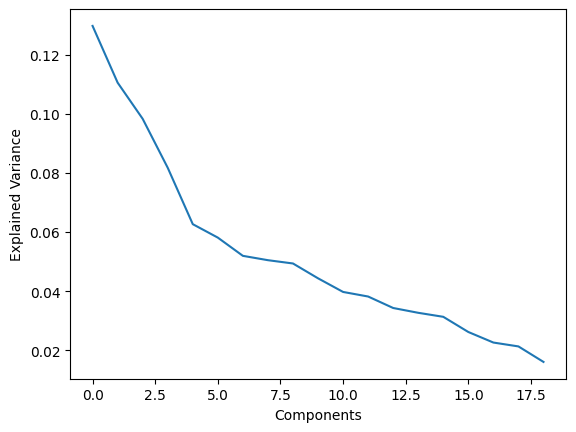
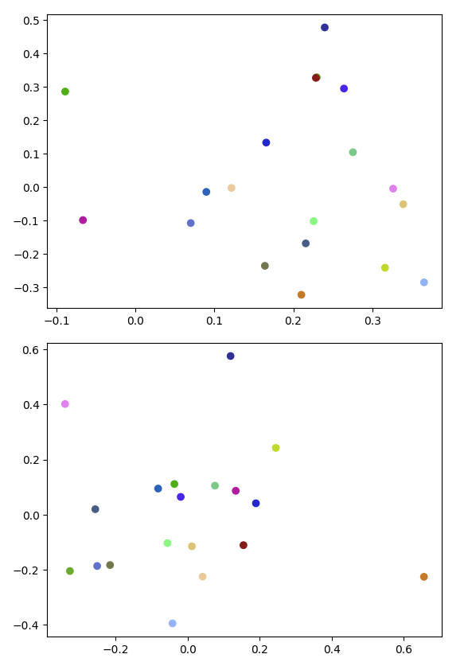
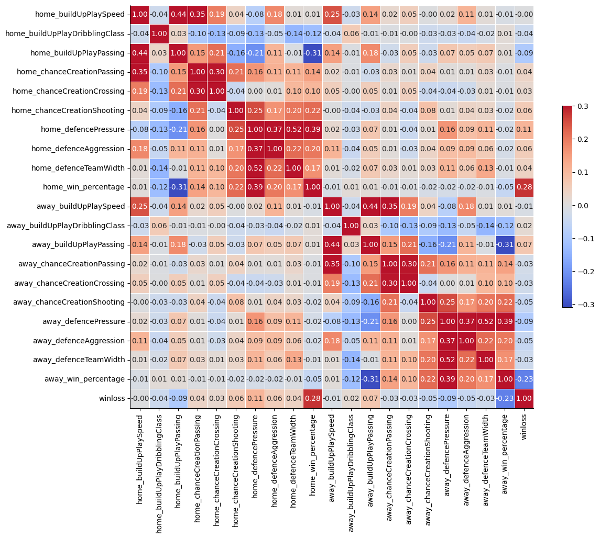
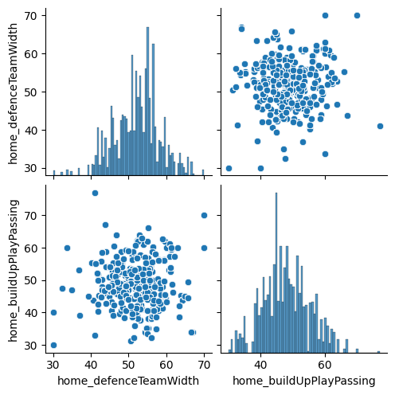
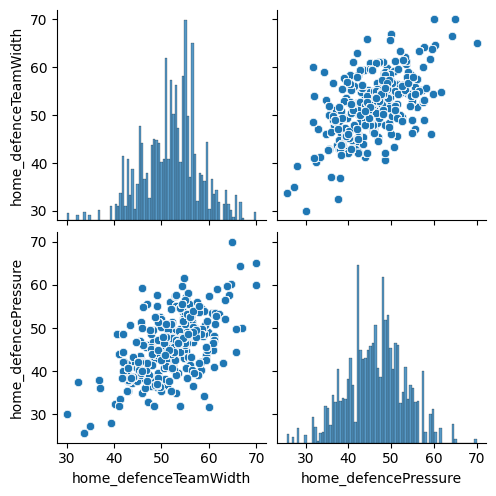
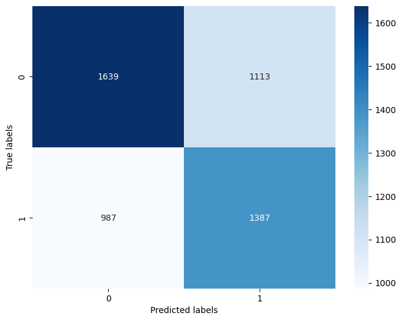

# Final Report

## Introduction/Background: A quick introduction of your topic and mostly literature review of what has been done in this area. You can briefly explain your dataset and its features here too.

Soccer, more commonly known as football in Europe and other parts of the world, is one of the most popular sports in the world, with over 1.5 billion people watching the FIFA World Cup final on television. Most approaches to solving the problem of scoreline prediction in soccer have involved match specific data restricted to past score lines, team lineups (which players played and how they performed), shots on target e.t.c. 

We would like to take a novel approach to solving this problem, by involving team specific data regarding playstyle that we took from the official FIFA video game coupled with game data. FIFA comes up with these metrics using the Ratings Collective, which is a scouting organization that observes league games from all over the world and develops detailed reports on players and teams. 

We will be using a training dataset that contains all match data played in major UEFA regulated leagues, team playstyle data from the 2008-2016 seasons. It has several features - - buildUpPlaySpeed, Team_id, matches - - among others that we have narrowed down to the most relevant ones in our methods section. 

## Problem definition: Why is there a problem here or what is the motivation of the project?

The data that we collected was directly sourced from a dataset from Kaggle as cited below, which contains the team attribute data and matches played in European Soccer from 2008-2016. The training set currently contains a sample of some of the matches played during this time period with the relevant statistics and we are currently testing our model on the remaining data. 

## Data Collection:

The data that we collected was directly sourced from a dataset from Kaggle as cited below, which contains the team attribute data and matches played in European Soccer from 2008-2016. The training set currently contains a sample of some of the matches played during this time period with the relevant statistics and we are currently testing our model on the remaining data. 

## Methods:

Our goal is to see which team would possibly win in a match given their play style attributes. To these ends, we first need to preprocess and clean the data as well as engage in feature selection.

### Data Cleaning

To clean the data, we first sourced all the team specific attributes for each team and the matches played across the time period from the table. We then realized that there were a number of redundant columns that acted as classifiers for numerical values that were also within the team attributes table, for example, buildUpPlayPassing (int64) versus buildUpPlayPassingClass (discrete classification variable). The numerical team attribute values are a better indicator of the statistics, and therefore we eliminated the corresponding classification variable columns. 

However, for buildUpPlayDribbling, there is a lot of incomplete data, and therefore we made use of the class variable as it had complete values. Since this is a categorical feature, we used integer encoding (we will likely transition to one hot encoding later in the project).
We also noticed each team has multiple rows of statistics to highlight minor changes in team attributes from year to year. To standardize these statistics, we averaged them out since the overall deviation in attributes from year to year was deemed not significant enough. And for the categorical variable buildUpPlayDribbling, we simply took the mode as the value across all the multiple rows of statistics since averaging out a categorical variable would result in data inconsistencies. 

For every match, we then sourced the home team and away team attributes using a lookup function that we implemented. We then created another categorical feature to hold the match outcome (win/loss/draw)

We also created another data processing function that was able to sift through the matches that a given team had played and find their win percentage in the time period. This was an additional feature we added to our model compared to the midterm report since we came to the understanding that a team’s past history cannot be ignored. This proved to be valuable in increasing the accuracy of our models since, naturally, the teams with higher win-rates will have a higher chance of winning. 

At first, we attempted to perform dimensionality reduction using principal component analysis, or PCA. However, our accuracies for all three models decreased when using this approach. As an alternative, we attempted this using linear discriminant analysis (LDA) as well as recursive feature elimination (RFE). After analyzing and comparing results between the different dimensionality reduction , we found that LDA proved to be the most effective method of dimensionality reduction, as it resulted in the highest accuracies for each model.

The figure above shows the pca explained variance ratio for respective components. This is one of the visualizations that we have created in order to showcase our data. 

The figure above shows the scatter plot comparison of the first two pca components. The top graph shows the comparison before transformation and the bottom graph shows the comparison after transformation.

This is a correlation table of the home team vs away team data for the matches we have. We can split this up into 4 quadrants like a coordinate grid. Q1 and Q3 are all very close to 0, and this makes sense because they are displaying the correlation of the home team’s statistics with the away team’s statistics. Q2 is home with home and Q4 is away with away. We can see darker colors here, which indicate stronger relations (either negative or positive). However, we can see that our range of correlation is not too high (highest value being 0.52), which indicates that each feature is relevant to the team’s playstyle and is important to characterize the team. One interesting note about the validity of our data is that defenceTeamWidth and defencePressure have a relatively high correlation of 0.52. This makes sense because logically speaking, the size of a team’s defense will affect how much pressure the team can apply. Defenses that employ a high up the pitch pressure tactic tend to also be more spread out to cover more ground. 

This plot shows how defenceTeamWidth and playPassing are unrelated features. This makes sense because one relates to defence and one relates to offense.

This plot shows how defenceTeamWidth and defencePressure are related features. This makes sense because both are related to defence.

### Supervised Learning

For our project, we implemented three different supervised learning techniques. Initially, we used logistic regression to predict the binary result of a team winning or not based on a range of features relating to strategy and playstyle. In addition to using logistic regression, we also made use of random forest classification. Once again, we used these models to predict the binary result of a certain team winning or not winning against another team. 

## Results and Discussion:

After data processing, we were able to update the missing features in our dataset with our lookup function. We then used LDA to engage in dimensionality reduction, for which the results are shown below. 

### Logistic Regression
We ran our logistic regression model and our results were the following: 

Accuracy: 0.6500195083886071  
Precision: 0.6505907542407516  
Recall: 0.6412208751297976  
$$F_1$$-score: 0.6400280898876405  

All our current metrics are around par now, and have vastly improved from our midterm report due to our alternative methods of feature reduction and our redone analysis of our included features. Our accuracy is now 65% which means that more than half the predictions we’re making are currently correct. Most importantly, our 
$$F_1$$ score is currently 0.6400. An acceptable  $$F_1$$ score would at least have to be above 0.60, which means that our model is currently performing better than before. The F1 score that we have currently makes sense when looking at our higher recall and precision. 

The $$F_1$$ score must also be from 0 to 1.Note that an $$F_1$$ score of 1.0 represents perfect precision and recall and a score of 0 means either precision or recall is 0. I believe that the reason for us having a much better metrics is due to incorporating team past win history into our features since past behavior of a team is a good indicator of how they will perform. 

This is the confusion matrix for our logistic regression model. 

### Random Forest

We can compare this performance to the random forest model we implemented whose metrics are as follows. 

Accuracy: 0.5903238392508778  
Precision: 0.5894715917745621  
Recall: 0.5899064293900982  
$$F_1$$-score: 0.589331327969861  

Our accuracy and $$F_1$$ scores are lower for the random forest model at 0.590 and 0.589 respectively. However, this is still a marked improvement over our first logistic regression model that we ran at the project midpoint. This shows that incorporating the past win rate of the team did in fact improve our accuracy across the board, showing better feature selection. 
These changes make sense as past win rates should be highly indicative of present and future success, and thus incorporating this information is expected to result in an increased accuracy. We can see this by increased accuracy, and the difference between our midterm accuracy and final accuracy show the improvements that the addition of past win rates resulted in.

This is the confusion matrix for our random forest model. 

### K Means

We also decided to implement an unsupervised learning algorithm. We implemented K-means clustering to gain some more insight into how playstyles could be segmented. We ran the algorithm with 2 clusters and a standardized initialization. Our analysis of the clustering results was more qualitative in nature as we used our general soccer intuition to figure out what the innate meaning of the clusters were. 
Our results showed that teams which were more possession based in their playstyle such as Manchester City, Liverpool, and Barcelona were all grouped together in one cluster while more counter attacking teams such as Manchester United, Real Madrid and Atletico Madrid were grouped together in another cluster. This makes sense as all the team attributes that were our features, and their values should ideally group teams with similar play styles together. 

## Conclusion

Our group was able to drastically improve our model accuracy through better feature selection. In hindsight, we could have further re-evaluated our model to incorporate more features that indicated performance history of the team such as their record against their opponents in the past, or the overall record of the team in that given competition. However, we think that our model performs to a relatively satisfactory degree considering that match prediction for any sport has proven to be a notoriously difficult task. 

We were also able to gain additional insights into our data using an unsupervised learning as we were able to cluster teams based on their playstyle, which shows that our attribute values did play a role in indicating the way in which the team played to a decent degree. 

## Contribution Table

Nav: Supervised Learning, Logistic Regression, Random Forest, K Means

Dhriti: GitHub Page, Problem Definition, Data Visualizations and Cleaning, Random Forest

Rishi: Data Visualizations and Cleaning, Logistic Regression, K Means, Conclusion 

Tarun: Data Visualizations and Cleaning, Supervised Learning, K Means, Conclusion

Nat: Problem Definition, Data Visualizations and Cleaning, Logistic Regression, Random Forest
